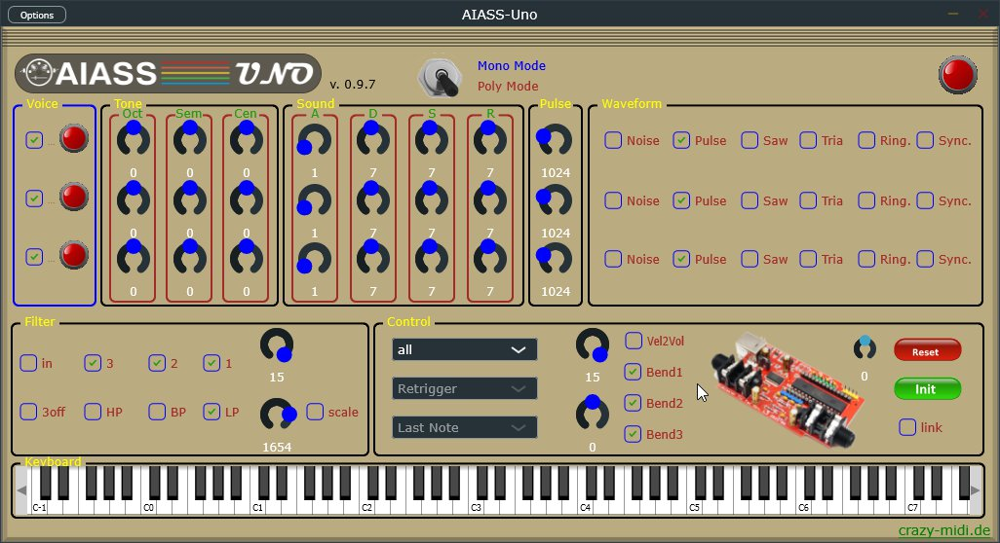

# AIASS-Uno VST

A VST plugin that drives real SID chip hardware (MOS 6581/8580) via
[SIDBlaster-USB](https://github.com/gh0stless/SIDBlaster-USB-Tic-Tac-Edition) -
register-level hardware remote control, not classic audio DSP emulation.

Compiled binaries also available on [www.crazy-midi.de](https://www.crazy-midi.de).

AIASS-Uno is the further development of AIASS-Mono, now with poly mode.

## Description

In the event of errors (wrong or missing `hardsid.dll`, no SIDBlaster
connected) the red LED flashes and, on fatal init failure, a dialog explains
what's wrong. See the manual for details.

## Build

Built with [JUCE](https://juce.com) 9.0.0 via the Projucer.

##### Windows

Open the project in the Projucer, export for Visual Studio 2022, and build.
`hardsid.dll` must be next to the host exe (or, for the standalone build, next
to `AIASS-UNO.exe`) - or copied into `C:\Windows`. 32-bit is no longer
supported.

##### Linux

Open the project in the Projucer, export for Linux Makefile, then
`make CONFIG=Release`. If memory is tight, use `make CONFIG=Release -j1` to
avoid parallel compilation.

##### macOS

Open the project in the Projucer, export for Xcode, and build.

## Version

Current release: **1.0**

## Hardware

https://github.com/gh0stless/SIDBlaster-USB-Tic-Tac-Edition

## hardsid.dll

https://github.com/gh0stless/SIDBlasterUSB_HardSID-emulation-driver

## License

AIASS-Uno VST is licensed under GPL v3:
https://www.gnu.org/licenses/gpl-3.0.en.html

Please also note the JUCE end user license: https://juce.com/juce-9-licence

The original SIDBlaster-USB was created by Davey:
https://github.com/stg/SIDBlaster-USB

`hardsid.dll` for SIDBlaster-USB is by Stein Pedersen, Linux/macOS port by
Ken Händel - see the fork linked under [hardsid.dll](#hardsiddll) above.

## Thanks

Thanks a lot to Wilfred Bos, Stein Pedersen & Ken Händel for your help.

Thanks to Davey for the SIDBlaster-USB.

And to my bride-to-be, Borjana Konstantinowa, for your patience with me.

***- Andreas Schumm (gh0stless), crazy-midi.de***
