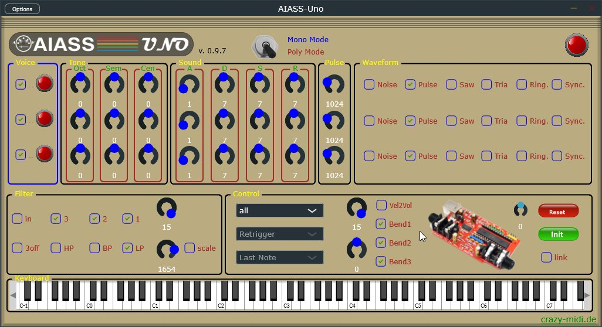

# AIASS-Uno VST

... is a quick and dirty VST-Plugin for use with SIDBlaster-USB, made by Juce Framework.

Compiled binary files also on www.crazy-midi.de.

It is the further development of the AIASS-mono.

The AIASS-Uno now also has a poly mode.

## Description
In the event of errors (wrong or missing DLL, no SIDBlaster connected) the red LED flashes. See manual.

## Build

##### windows

Open project in Projucer (part of juce package)(status: version 8.0.4) and export to and compile with Visual Studio 2022.

Under Windows, the correct hardsid.dll must be in the same folder as the host exe or, in the case of the standalone version, in its folder.

Or, you copy it in the C:\Windows folder. 32 bit Version not longer supported.

##### linux
Open project in Projucer then build with "make CONFIG=Release".

If memory is tight, try make -j1 to avoid parallel compilation.

##### macOS
Open Project in Projucer and export an build with XCode.

## Hardware

https://github.com/gh0stless/SIDBlaster-USB-Tic-Tac-Edition

## hardsid.dll

https://github.com/Galfodo/SIDBlasterUSB_HardSID-emulation-driver

https://haendel.ddns.net/~ken/sidblaster.html

## License

AIASS-Uno VST is under GPL v3:

https://www.gnu.org/licenses/gpl-3.0.en.html

Please also note the end user license of Juce: 

https://juce.com/juce-5-license

The original SIDBlaster-USB was created by Davey:

https://github.com/stg/SIDBlaster-USB

hardsid.dll for SIDBlaster-USB is by Stein Petersen:

https://github.com/Galfodo/SIDBlasterUSB_HardSID-emulation-driver

linux/mac port of hardsid.dll by Ken Händel:

https://haendel.ddns.net/~ken/

https://haendel.ddns.net/~ken/sidblaster.html

## Thanks

Thanks a lot: Wilfred Bos, Stein Pedersen & Ken Händel for your help. 

Thanks Davey for the SIDBlaster-USB.

And to my bride-to-be, Borjana Konstantinowa,  for your patience with me 

***-Andreas Schumm (gh0stless) in December 2021***

