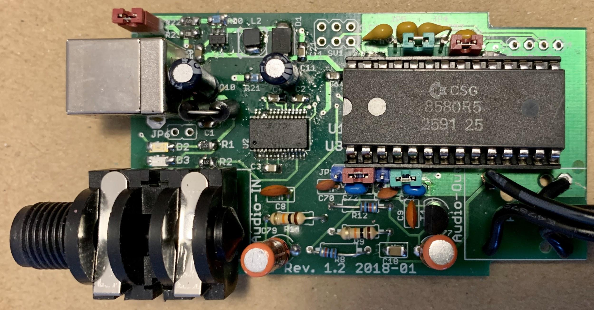
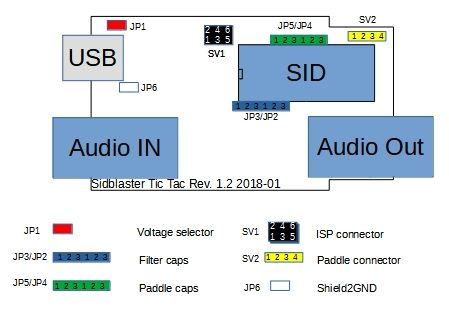
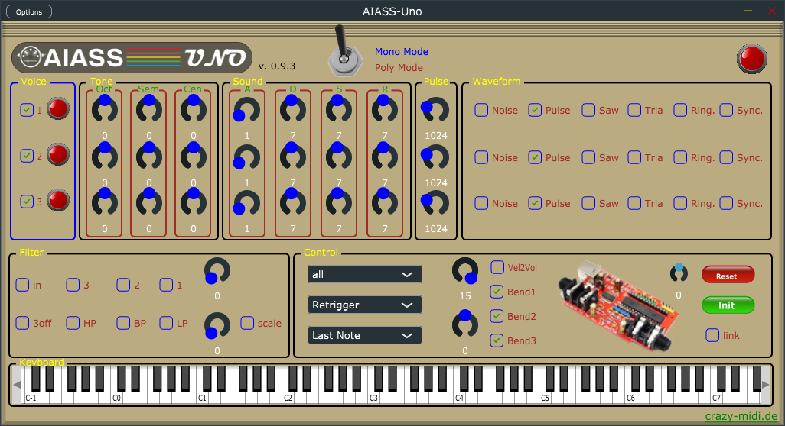
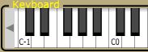
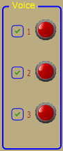
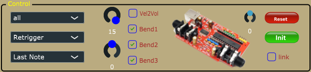
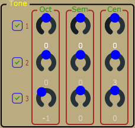
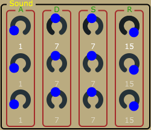
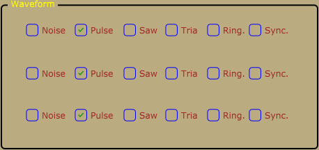
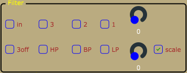

# AIASS-Uno-VST

A VST for the SIDBlaster-USB

Programming and UI design by Andreas Schumm

Copyright © 2026 [www.crazy-midi.de](http://www.crazy-midi.de/)

English manual with help from Magnus Hansson, version 0.9.3

*AIASS Is A SID Synthesizer*

# General information

- Plug and play is not possible, the SIDBlaster must be plugged in before using in an application. Also, do not unplug the SIDBlaster before you have finished the application.
- When you are not using the SIDBlaster it is recommended to unplug the USB-connection since this prolongs the life of the SID-chip.
- Since a SID-chip produces heat, use a heatsink on the chip if possible and make sure there is sufficient ventilation.

# Hardware installation

## SID-chip installation



*A SIDBlaster-USB with correct installed 8580*

## Jumper settings



### For the 6581 SID-chip:

- JP1: must be open (12V).
- JP2-JP5: Place all jumpers on the left side (pins 1-2).

### For the 8580 SID-chip:

- JP1: must be closed (9V).
- JP2-JP5: Place all jumpers on the right side (pins 2-3).

## Other jumpers on the hardware

### JP6 (White)

From Rev. 1.2 and on. Experimental, connects USB shield to ground; you may try it to counteract interfering noise.

### SV2:Paddle connector (yellow)

Here you have access to the two A/D converters of the SID chip. For example, you can connect 2 rotary potentiometers as paddles. This is of interest for programmers. You can also use the function with the SID object for Max/MSP.

| Pin | Function |
|---|---|
| 1 | +5V |
| 2 | POTX |
| 3 | POTY |
| 4 | GND |


### SV1: ISP Connector

Use a Picit 3 programmer to flash the microcontroller. MPLAB IPE is used as software.

| Pin | Function |
|---|---|
| 1 | MCLR/VPP |
| 2 | +5V |
| 3 | GND |
| 4 | PGD (ICSPDAT) |
| 5 | PGC (ICSPCLK) |
| 6 | n.c. |


## USB and audio connections

### USB jack

Connect the SIDBlaster hardware to a USB port using a type A-B USB cable of good quality. It can also work with a good quality USB-hub.

### Audio-out jack

The audio output is designed as a professional 1/4" jack socket. Connect the audio output of the SIDBlaster to your mixer or audio interface using an unbalanced (mono) cable.

### Audio-in jack

The second audio jack on the SIDBlaster is an audio input and is also an unbalanced connection. If you are unsure which connector is which, the connectors are marked on the PCB. Be careful about what you connect to the input of the SID-chip. These chips are old and very sensitive to electrical spikes and too high voltages.

# Software installation

## The FTDI D2XX driver

### Windows

The SIDBlaster needs to do a digital "handshake" the first time it is connected via USB. This requires an internet connection. The handshake will not work if your internet connection is set to "Metered Connection" in Windows. To solve this, temporarily disable "Metered Connection", wait a moment for the SIDBlaster to do the handshake, and then re-enable "Metered Connection".

The latest Windows versions provide the FTDI driver via the update function. So check: Settings / Updates / Optional Updates.

The SIDBlaster is recognized by Windows as a "USB Serial Converter". It may be recognized as a COMx device with ports (in Device Manager). Edit: Your SIDBlaster have to be flashed correctly with the FTDI prog tool and the template from the SIDBlaster project in this case. The actual hardsid.dll doesn't accept incorrectly flashed SIDBlasters.

With older versions of Windows, installation of a driver by FTDI may be necessary, available at: <http://www.ftdichip.com/Drivers/D2XX.htm>

### Linux

Download D2XX driver from: <https://ftdichip.com/drivers/d2xx-drivers/>

Please install FTDI drivers explained in chapter '2 Installing the D2XX driver' from here: <https://www.ftdichip.com/Support/Documents/AppNotes/AN_220_FTDI_Drivers_Installation_Guide_for_Linux.pdf>

If device still cannot be used, please install a workaround mentioned in chapter '1.1 Overview':

```
$ sudo vi /etc/udev/rules.d/91-sidblaster.rules

ACTION=="add", ATTRS{idVendor}=="0403", ATTRS{idProduct}=="6001", MODE="0666", RUN+="/bin/sh -c 'rmmod ftdi_sio && rmmod usbserial'"

$ sudo udevadm control --reload-rules && udevadm trigger
```

### MacOS

Note: it may be necessary to switch off the security monitoring in MacOS or to authorize all developers.

```
sudo spctl --master-disable
```

The following could also work:
```
sudo xattr -rd com.apple.quarantine / Your software path.app
```

Download and install D2XX Driver from: <https://ftdichip.com/drivers/d2xx-drivers/>

use the instructions from: <https://ftdichip.com/wp-content/uploads/2020/08/AN_134_FTDI_Drivers_Installation_Guide_for_MAC_OSX-1.pdf>

Download and install D2XXHelper from the same site.

## The hardsid library

Is the "driver" of the SIDBlaster, so to say. Under Windows it comprises a reprogrammed DLL of the Hardsid, thus, software programmed for the Hardsid becomes compatible for the SIDBlaster. Later the DLL was ported to Linux and MacOS. The DLL is made and maintained by Stein Pedersen. Linux/Mac port was made by Ken Händel.

### Windows

- Download from: <https://crazy-midi.de/joomla/index.php/mydownloads>
- Copy the right hardsid.dll into the program directory of the program with which you want to use it.
- The 64 bit version is required by the 64 bit version of vice and also by the 64 bit versions of AIASS.

### Linux

- Download from: <https://crazy-midi.de/joomla/index.php/mydownloads>
- copy libhardsid.so to /usr/local/lib/
- apply chmod 0755 on libhardsid.so
- copy hardsid.hpp to /usr/local/include/

### MacOS

- Download from: <https://crazy-midi.de/joomla/index.php/mydownloads>
- copy libhardsid.dylib to /usr/local/lib/
- copy hardsid.hpp to /usr/local/include/

## SIDBLASTERUSB_WRITEBUFFER

Depending on your system, tunes with high data rates (multi speed tunes or digitunes) may play slower if the latency of the USB driver is too high. This can be remedied by setting the driver write buffer size to a smaller value, for instance. Even down to 0, works on fast machines.

### Windows
```
set SIDBLASTERUSB_WRITEBUFFER_SIZE=8
```

### Linux/MacOS
```
export SIDBLASTERUSB_WRITEBUFFER_SIZE=8
```

## The SIDBlasterTool

With SIDBlasterTool you can check if library and device communication works.

You can also set the SID type and change the serial number. The type is saved as part of the device description and evaluated by applications such as JSIDPlay.

## Notes for developers

For developers who want to write applications using the hardsid library, I refer to hardsid.hpp. You can find a few more tips in the AIASS-VST repository in the doc folder. Do not forget to call the destructor method manually when exiting under MacOS and Linux.

Detailed instructions on how to create the hardsid library can be found here (thanks to Ken Handel): <https://haendel.ddns.net/~ken/sidblaster.html>

# AIASS-Uno-VST



The plug-in is available in three variants for each system: VST2, VST3 and standalone version.

## Install the VST

### Windows:

Copy the AIASS-Uno.dll into your VST2 directory. Copy the AIASS.vst3 into your VST3 folder. Copy the hardsid.dll into the program folder of your DAW host program and into the VST3 folder.

If you want to use the standalone version, make sure that the hardsid.dll is in the same folder. Set a correct audio output in the options of the standalone version, even if the program itself does not emit any sound.

### Linux

Copy the VST2 and the VST3 into your respective folder (for me ~/.VST and ~/.VST3).

FTDI driver and hardsid library must be installed correctly.

The standalone version can only be started via the terminal.

### MacOS

Copy the VST2 and VST3 into the respective folders in: `~/Library/Audio/Plug-Ins/`

FTDI driver and hardsid library must be installed correctly.

You may need to take steps to ensure that apps are run by non-Apple-licensed developers. It may be necessary to switch off the security monitoring in MacOS or to authorize all developers.

```
sudo spctl --master-disable
```

Could also work:
```
sudo xattr -rd com.apple.quarantine / Your software path.app
```

## Power LED


If the Power LED flashes there is an error. This could mean that the hardsid.dll file is not found or that the computer can not find the SIDBlaster hardware. In normal operation the LED indicates incoming MIDI messages.

## Poly/Mono Switch


This switch toggles between poly and mono mode. Note that the sound of each voice can also be set differently in polymode.

## Keyboard Section



Shows incoming MIDI notes, and you can play notes, note that the position on the key determines the velocity. Only plays on MIDI channel 1.

## Voice Section



You can use the checkboxes to select or deselect voices. This only works in mono mode. The LEDs indicate the triggering of the voices.

## Master section



### Volume & Vel2Vol

Master volume. To get the best possible signal to noise ratio, it is best to leave it a 15.

Vel2Vol: When activated velocity will control Master volume.

### MIDI & Keyboard Playmodes


**Midi Channel select:** Setting the MIDI channel to be used for listening.

**Play mode:**
- Retrigger - Notes are retriggered every time a key is pressed, but if more than one key is held, the note will return to its previous pitch after the second key is released.
- Legato - Notes are played Legato, i.e. the pitch "glides" between notes.
- Last step - Notes are retriggered every time a key is pressed, and if more than one key is held the previous note will be cut off.

**Note priority mode:**
- Last Note priority prioritises the last Midi note when several notes are pressed.
- High Note priority prioritises the highest Midi note when several notes are pressed.
- Low Note priority prioritises the lowest Midi note when several notes are pressed.

### Pitchbend


Represents the PitchBend controller, with the 3 buttons you can select which voices you want to influence with Pitchbend. (Up/Down 1 Octave.)

### Reset & Ini


The SID chip can get into an undefined state, with Reset you can reset it, your settings are retained. Init is a SID-reset and a simultaneous reset to factory settings.

### Link Button


Links the controls for oscillator tuning, ADSR and Pulse Width, which is helpful when adjusting the sound for all oscillators at the same time. If unchecked, all controls are edited one by one.

### Tune Slider

Due to the hardware, your SIDBlaster will not be 100 percent correct. Use a tune utility, such as a plugin in your DAW, to tune this knob (+/- 100 cents).

## Oscillator and envelope section

There are 3 oscillators on a SID chip, each with its own ADSR envelope hardwired to the VCA (Voltage Controlled Amplifier), i.e. creating a volume envelope. The filter is not connected to an envelope on the SID chip by design.

However, there are ways around this as described in the tips section.

### Oscillator Pitch section



The oscillator pitch can be changed using the:

- **Oct** = Changes the oscillator pitch up or down in one octave steps
- **Semi** = Changes the oscillator pitch up or down in semitone steps
- **Cent** = Fine tunes the oscillator pitch

### ADSR envelope and Pulse Width




- **ADSR** = As mentioned above, each oscillator has its own ADSR envelope. It allows control of the Attack, Decay, Sustain and Release time of each oscillator's VCA (Volume envelope).
- **Pulsew.** = This controls the Pulse Width for each oscillator. It is particularly useful when using the Pulse waveform.

### Waveforms and Noise



Each oscillator has three waveforms, Pulse, Saw and Triangle, plus Noise. Several waveforms can be selected at the same time. However, the noise can not be combined with the other waveforms.

**Ring modulation:** This effect is only audible when the Triangle wave is activated.

- Ringmod.1 activates the Ring Modulation on Voice 1. The Oscillator must be set to Triangle Wave. It is a ring modulation of voice 1 and voice 3.
- Ringmod.2 activates the Ring Modulation on Voice 2. The Oscillator must be set to Triangle Wave. It is a ring modulation of voice 2 and voice 1.
- Ringmod.3 activates the Ring Modulation on Voice 3. The Oscillator must be set to Triangle Wave. It is a ring modulation of voice 3 and voice 2.

**Sync.:** Synchronizes the Oscillators to each other.

- Sync. 1 activates the Oscillator Sync on Voice 1. This syncs Voice 1 with Voice 3. The frequency of Voice 3 must be lower than Voice 1 for it to have any audible effect.
- Sync. 2 activates the Oscillator Sync on Voice 2. This syncs Voice 2 with Voice 1. The frequency of Voice 1 must be lower than Voice 2 for it to have any audible effect.
- Sync. 3 activates the Oscillator Sync on Voice 3. This syncs Voice 3 with Voice 2. The frequency of Voice 2 must be lower than Voice 3 for it to have any audible effect.

### Filter section



- **In** = There is an option to activate the filter for the external input. This will raise the noise level since the input of a SID-chip is quite noisy by design. Actually, the SID-chip is pretty noisy, but that's also part of the charm. As mentioned above, please be careful about what you connect to the input of the SID-chip. SID-chips are old and very sensitive to electrical spikes and too high voltages.
- **Filter activation buttons** = The filter is activated for each oscillator separately (oscillator 1-3).
- **Scale button** = There are two main types of SID-chip, the 6581-version and the newer 8580-version. The main difference is the filter. The 8580-version has an updated filter where the resonance control is more effective. The cutoff characteristics are also different between the two chips. The two modes of this button sets the cutoff scale for the 8580 and 6581 respectively. Try both scales, it might sound nice.
- **Filter types** =
  - LP = Low Pass
  - BP = Band Pass
  - HP = High Pass

  All filter types can be freely combined.
- **Freq.** = Changes the filter Cutoff Frequency for all oscillators which have their filter activated.
- **Res.** = Changes the Resonance amount for all oscillators which have their filter activated.

# MIDI Implementation

| Parameter | CC |
|---|---|
| Octave1 | CC78 |
| Octave2 | CC85 |
| Octave3 | CC88 |
| Semi1 | CC79 |
| Semi2 | CC86 |
| Semi3 | CC89 |
| Cent1 | CC70 |
| Cent2 | CC87 |
| Cent3 | CC90 |
| Attack1 | CC73 |
| Attack2 | CC20 |
| Attack3 | CC25 |
| Decay1 | CC75 |
| Decay2 | CC21 |
| Decay3 | CC26 |
| Sustain1 | CC76 |
| Sustain2 | CC22 |
| Sustain3 | CC27 |
| Release1 | CC72 |
| Release2 | CC23 |
| Release3 | CC28 |
| PulseW.1 | CC77 |
| PulseW.2 | CC24 |
| PulseW.3 | CC29 |
| Cutoff | CC74 |
| Resonance | CC71 |
| SID-Volume | CC07 |
| Pitchbend | Pitchbend |

# Tips

- Add LFO's.
- Add ADSR-envelopes.
- Lower the AIASS the Decay and Sustain settings if you get internal distortion. The SID-chip distorts quite easily, especially when playing all oscillators at the same time.
- Try an Arpeggiator with a fast tempo on the Mono version of AIASS to get classic Commodore C64 arpeggiated "chords".

# Links

- <http://crazy-midi.de/>
- <https://github.com/gh0stless/SIDBlaster-USB-Tic-Tac-Edition>
- <https://github.com/gh0stless/SIDBlasterTool>
- <https://github.com/gh0stless/sid-object>
- <https://github.com/gh0stless/AIASS-for-MAX4LIVE>
- <https://github.com/gh0stless/AIASS-Uno-VST>
- <https://github.com/gh0stless/SIDBlasterUSB_HardSID-emulation-driver>
- <https://vice-emu.sourceforge.io/>
- <https://www.acid64.com>
- <http://www.gsldata.se/c64/spw/> (SIDPlay2)
- <https://haendel.ddns.net/~ken/> (JSIDPlay2)
- <https://sourceforge.net/projects/goattracker2/>
- <https://www.facebook.com/groups/2305052182957954/>

# Thanks to

- Davey (The Phantom) for creating the original SIDBlaster.
- Wilfred Bos for his tips and helping.
- Stein Pedersen for his assistance and the sidblaster.dll.
- Ken Händel for the POSIX port and his work on the library
- Rico Frenzel for help and testing.
- Karl-Werner Riedel for his help with designing the TicTac hardware.
- Magnus Hansson for writing parts of this original manual.
- Yvonne Hölzel for proofreading.
- Borjana Konstantinowa for her patience with me.

Coswig, Saxony 02/02/22
